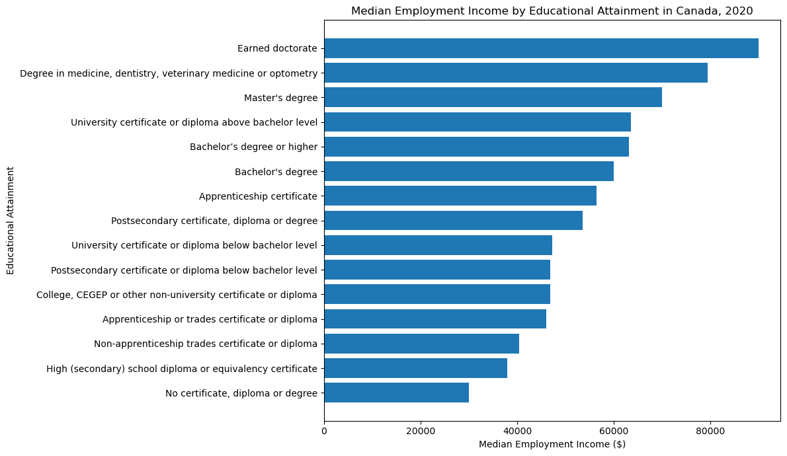
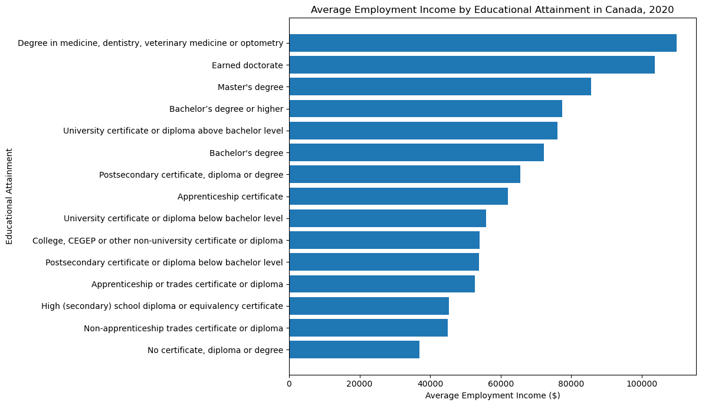
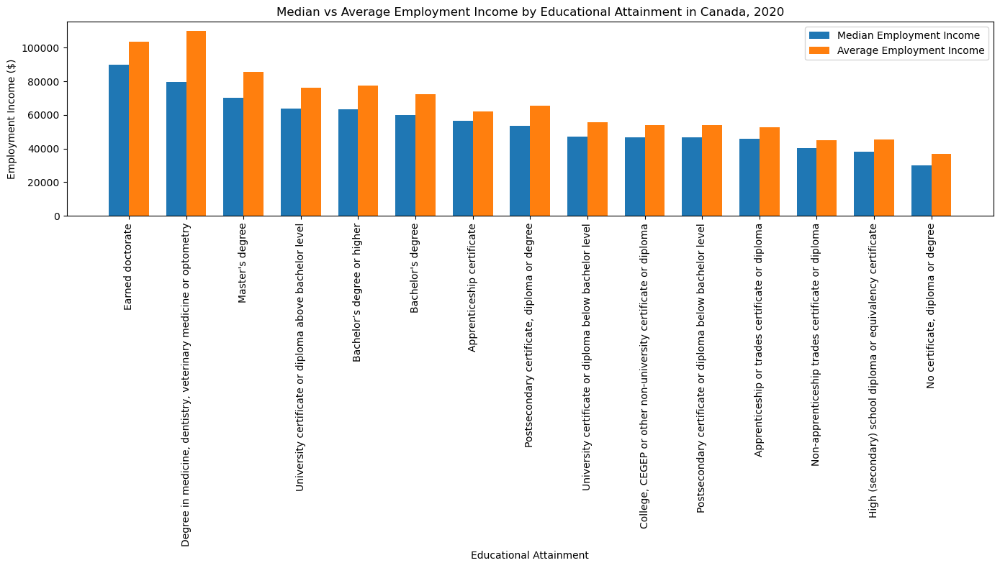

# Educational Attainment and Employment Income in Canada

## Project Objective

The objective of this project is to analyze how educational attainment is associated with employment income in Canada. The project uses Statistics Canada data to compare median and average employment income across different education levels.

## Research Question

How is educational attainment associated with employment income in Canada?

## Hypotheses

**H0:** Average employment income does not differ significantly across educational attainment levels in Canada.

**H1:** Average employment income differs significantly across educational attainment levels in Canada.

## Dataset

The dataset used in this project comes from Statistics Canada.

**Table:** 98-10-0411-01  
**Topic:** Employment income statistics by highest level of education  
**Geography:** Canada  
**Income year:** 2020  
**Age group:** 25 to 64 years  
**Gender:** Total - Gender  
**Source:** [Statistics Canada Table 98-10-0411-01] (https://www150.statcan.gc.ca/t1/tbl1/en/tv.action?pid=9810041101)

**Note:** The full CSV file was not uploaded to this repository due to its large file size. The data can be downloaded directly from Statistics Canada using the table number above.

## Tools Used

- Python
- pandas
- NumPy
- Matplotlib
- Jupyter Notebook

## Analysis Process

1. Loaded the Statistics Canada dataset.
2. Selected the relevant columns for the analysis.
3. Renamed columns for easier interpretation.
4. Filtered the data for Canada, total gender, age group 25 to 64 years, and income year 2020.
5. Removed the total education category to focus only on specific education levels.
6. Compared median employment income by education level.
7. Compared average employment income by education level.
8. Analyzed the difference between median and average employment income.
9. Identified the highest and lowest income groups.
10. Wrote a final conclusion based on the results.

## Key Findings

- Employment income varies across educational attainment levels in Canada.
- Individuals with higher educational attainment generally show higher employment income.
- The highest average employment income was observed among individuals with a degree in medicine, dentistry, veterinary medicine, or optometry.
- The highest median employment income was observed among individuals with an earned doctorate.
- The lowest median and average employment income was observed among individuals with no certificate, diploma, or degree.
- Average employment income was higher than median employment income across all education groups, suggesting that higher-income earners may increase the average.

## Visualizations

### Median Employment Income by Education Level

### Average Employment Income by Education Level

### Median vs Average Employment Income

## Conclusion

The results suggest that educational attainment is associated with employment income in Canada. Higher education levels tend to show higher median and average employment income. However, this relationship should not be interpreted as direct causation, since other factors such as occupation, work experience, industry, province, gender, and immigration status may also influence employment income.

## Future Extension

As a second phase, this project will analyze employment income differences by immigrant status. This extension will compare Canadian-born individuals, immigrants, and possibly non-permanent residents, while considering educational attainment as an important factor.

Possible research question for Phase 2:

How is employment income associated with educational attainment and immigrant status in Canada?